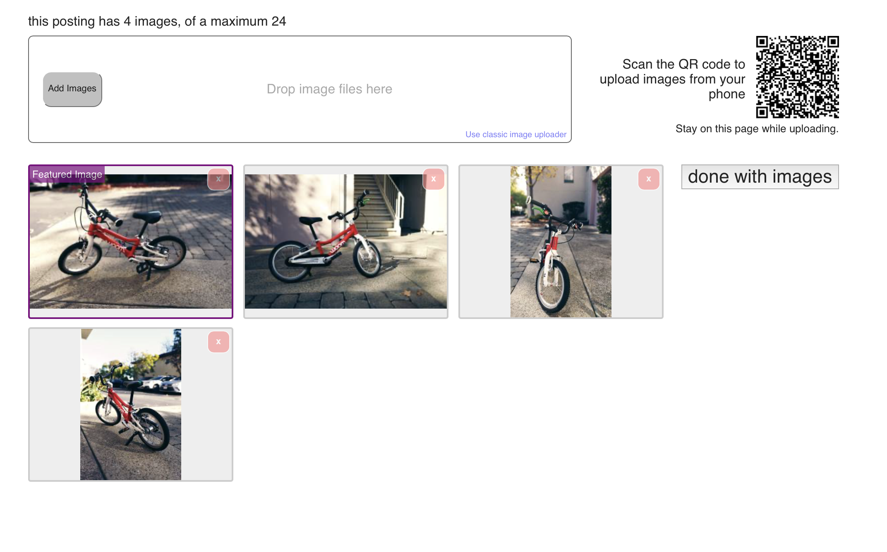
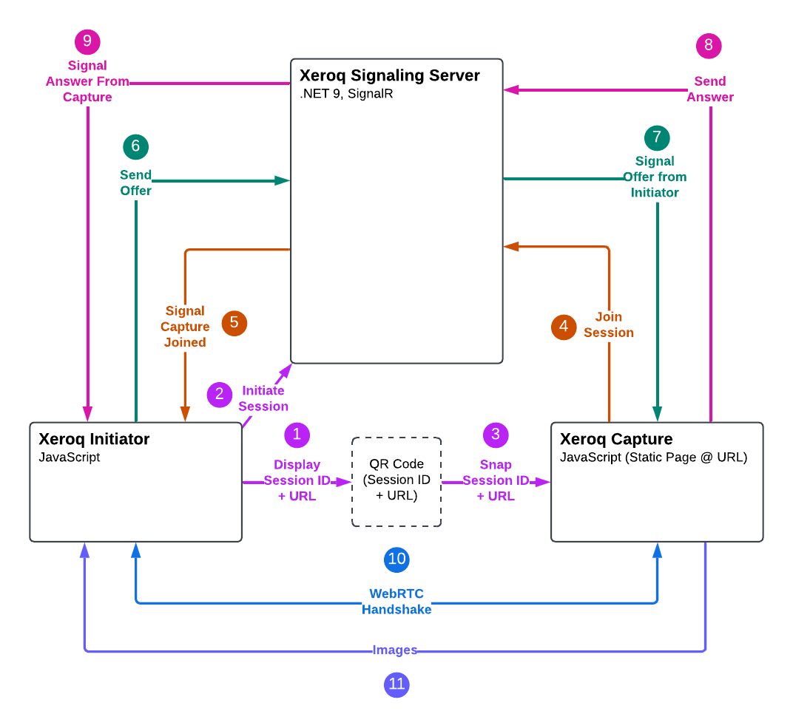

## Why Xeroq?

Ever start filling out a form on your desktop and then it asks you to upload a picture of your ID?

Then you take out your phone to take a picture, upload it to the cloud, and download it on your desktop before uploading it to continue the form?

Yup, we've all done that.  That's what Xeroq wants to solve.

## Xeroq is not novel

This approach isn't novel, in fact, Craigslist uses something similar for uploading photos:

But Xeroq is ***unique*** because it performs the exchange in a serverless way using WebRTC.

Xeroq makes this easy to implement in your own forms by providing:

1. An open source JavaScript library for both the initiator side (the form) and the capture side (the remote device side).
2. An open source .NET signaling server that connects the two sides via WebRTC so the files are exchanged peer-to-peer and never transit through a backend server.

## What does the flow look like?

Here's a high level overview of the flow and how the two sides connect.

1. At startup, the initiator generates a session ID and encodes it into a QR code.
2. The initiator also starts a connection to a SignalR server to register the session
3. From another device ("capture side"), the user scans the QR code
4. This initiates a connection to the signaling server via SignalR on the same session
5. The initiator is notified that the capture side has connected and generates and offer
6. The initiator transmits the offer to the capture side via the signaling server
7. The capture side receives this offer
8. The capture side generates an answer to the initiator and disconnects from the signaling server
9. The initiator receives the answer and disconnects from the signaling server
10. The two sides connect peer-to-peer via WebRTC using the offer and answer
11. The capture side transmits images to the initiator

## Terminology

Before diving deeper, let's get some terminology out of the way:

|Term|Definition|
|--|--|
|**Initiator**|The side where the user initiates the session; where the form is.|
|**Capture**|The remote side where the user will perform the actual capture or acquisition of the content.|
|**Offer**|This is a WebRTC term for the configuration data for the initiator that we need to transmit to the capture side.|
|**Answer**|This is a WebRTC term for the configuration data for the capture side that we need to transmit to the initiator.|
|**SignalR**|This is a Microsoft ASP.NET runtime component that provides a brokered web socket channel.  We use this channel to send the signaling data between the two sides to connect them.|

Let's look at a basic example 👇
