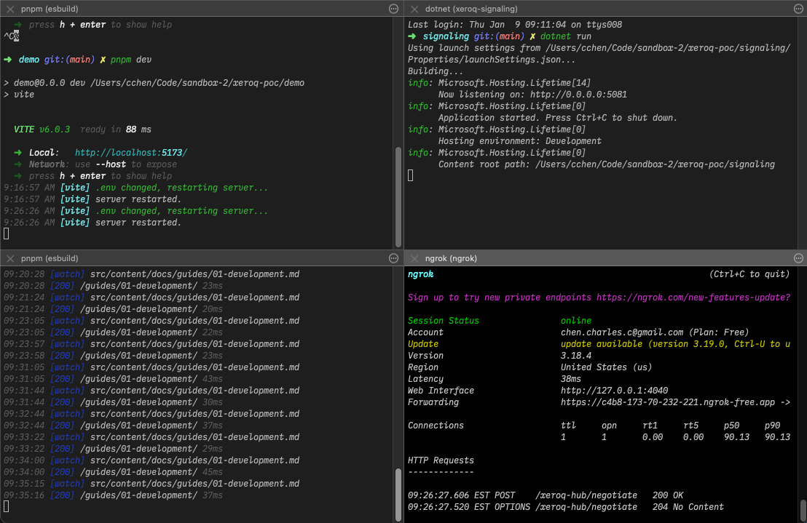

This document will guide you through how to set up for local development.

## Code Organization

The code is organized using a `pnpm` workspace which allows referencing of the package locally.

|Directory|Description|
|--|--|
|**Demo**|Contains a fully functional demo app written in Vanilla JS.|
|**Docs**|Contains this documentation that you are reading (an Astro.js project).|
|**Packages**|Contains the source for the actual NPM packages.|
|**Signaling**|Contains the signaling server implementation in .NET 9 using SignalR.|

The published documentation is hosted on Firebase using Firebase hosting and the demo app uses Google Cloud Run to run the backend on demand.  No database is present.

## Starting the Pieces



Development will typically involve 3 terminals (bottom left above is the docs):

|Root|Command|Description|
|--|--|--|
|`/signaling`|`dotnet run`|Start the signaling server on port `5081`|
|`/demo`|`pnpm dev`|Start the demo application on port `5173`|
|`/`|`ngrok http 5081`|Start `ngrok` to proxy an externally accessible URL to your local development environment (so you can test with your phone)|

In addition to this, I recommend using Visual Studio Code's built in [dev tunnels](https://code.visualstudio.com/docs/remote/tunnels). Forwarding to port `5173` (you can also use `ngrok` for this if you set it up for multiple ports).  For testing in the docs, you'll need to set up `4321` as well and update the `/docs/.env` file.

The two forwarded ports are covering different use cases, but both are required for you to test with your mobile device, for example.  `5173` (via dev tunnels) exposes the UI front-end in the `/demo` app.  `5081` via ngrok exposes the SignalR endpoint because dev tunnels does not play nicely with HTTP/2 which is used during the SignalR negotiation.

:::note
You can use any combination of proxy services that you'd like; you don't have to use dev tunnels and `ngrok`.
:::

In the `/demo` directory, make a copy of the `.env.sample` file and name it `.env`.

Here, you'll need to place the two proxy URLs:

```ini
# This is the URL assigned by dev tunnels; it is typically "static"
VITE_INTERFACE_URL=https://4gch11f2-5173.use.devtunnels.ms/

# This is the URL assigned by ngrok; if you do not have a paid
# account, this is dynamic
VITE_SIGNALING_SERVER_URL=https://c4b8-173-70-232-221.ngrok-free.app/xeroq-hub

# This is a static session ID to use for testing so that when the
# page refreshes, it regenerates the same session (typically random)
VITE_STATIC_SESSION=TEST_SESSION
```

:::caution
Every time that you restart `ngrok`, if you are on the free plan, you will need to update the `.env` file to ensure that it has the new external URL.  Feel free to use any service you like that offers similar functionality.
:::

## Demo App
